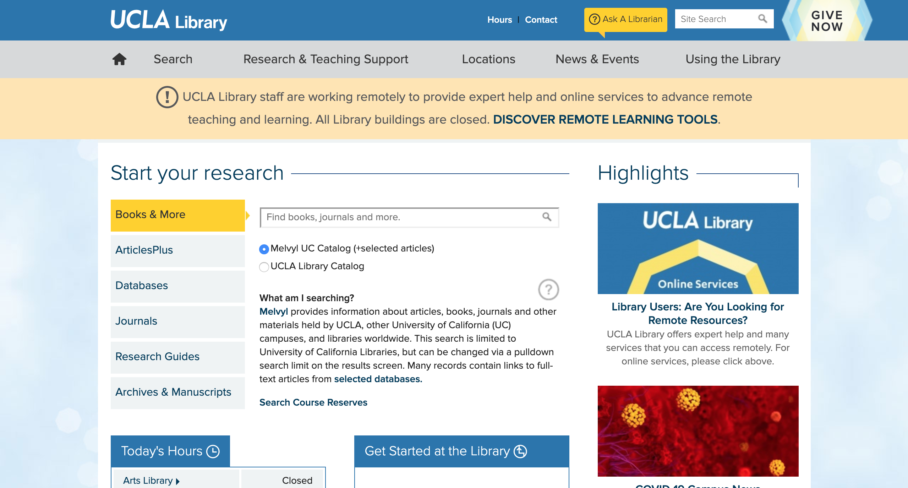
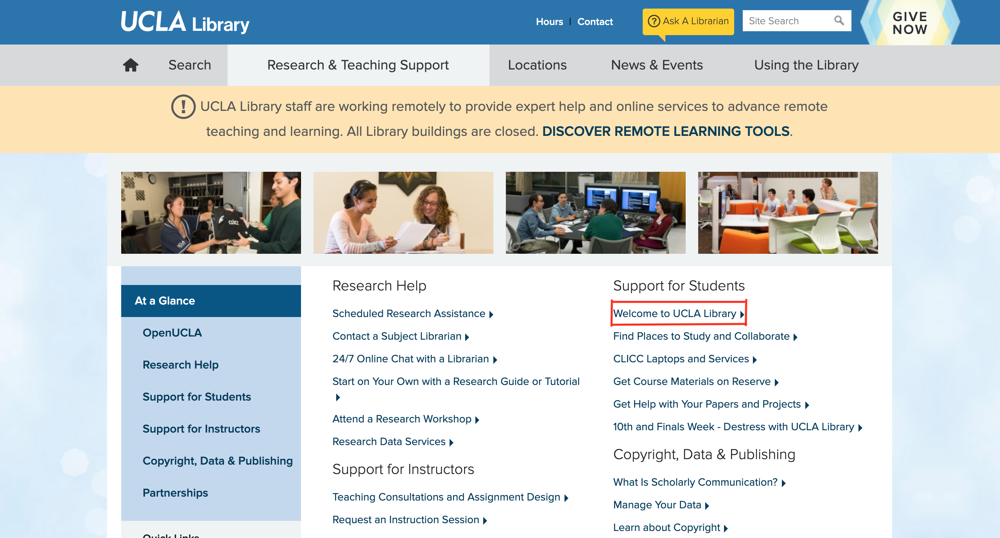
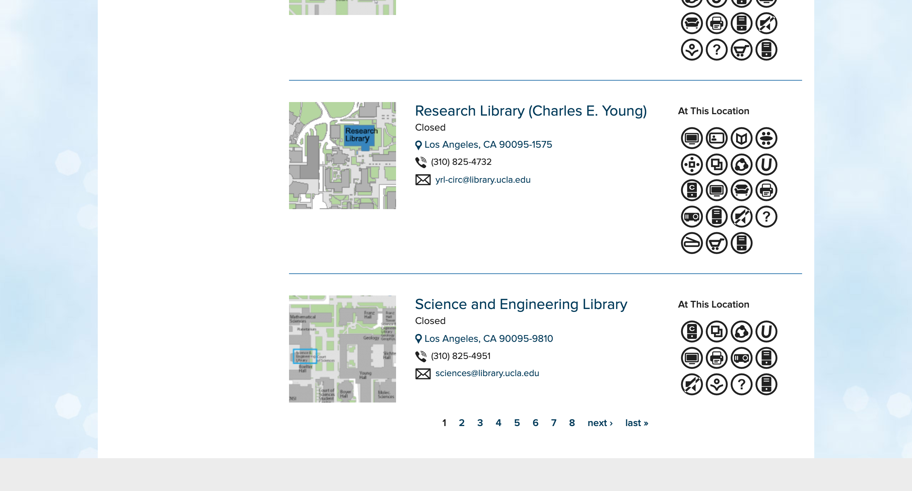
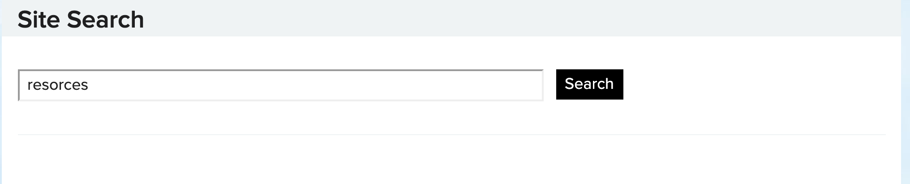
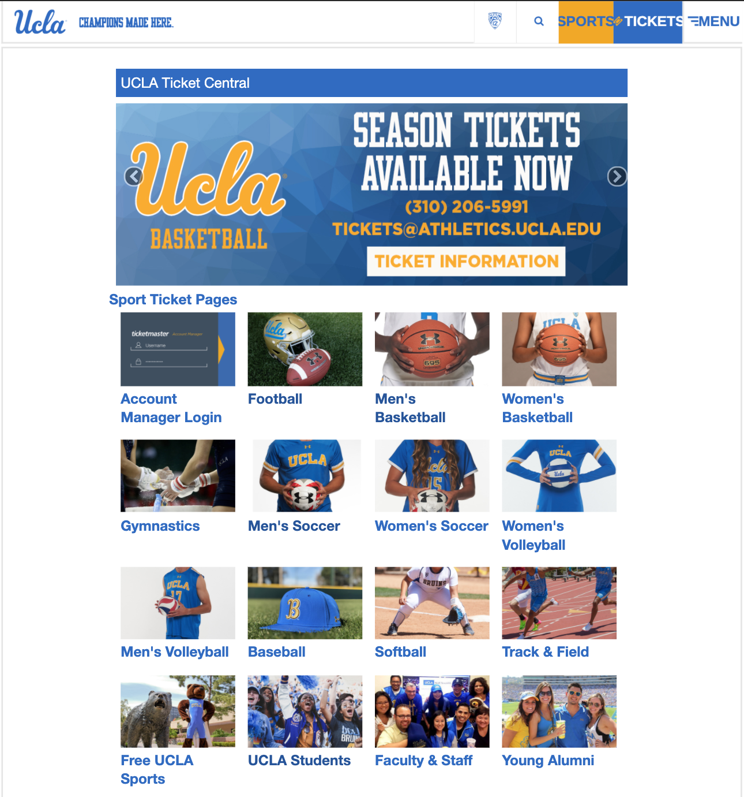
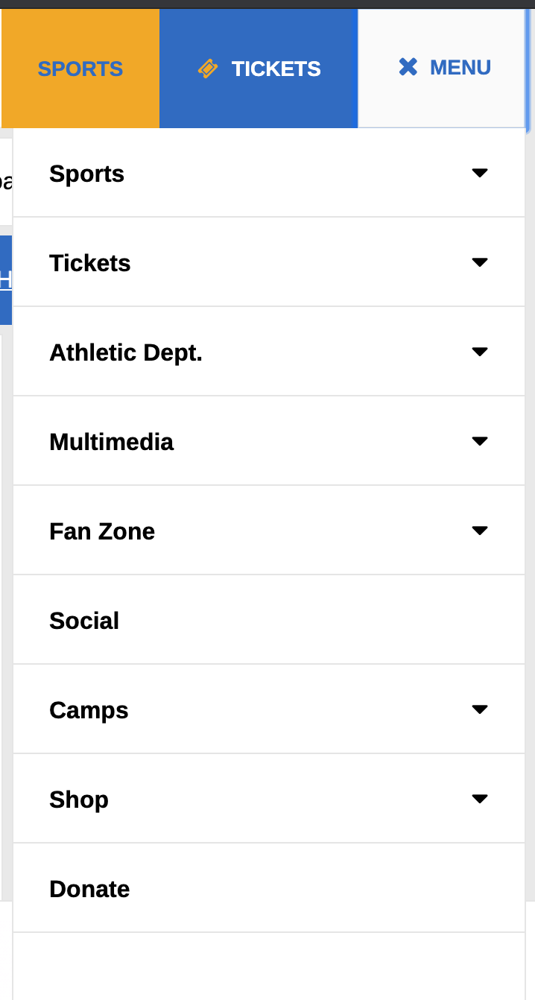

# Navigating UCLA: For Newcomers

## DH150 Assignment 01: Heuristic Evaluation by Danya Elgebaly

With remote resources currently on the rise, the desire for readily available online information has been increasing exponentially. The month of April is a crucial time for High School Seniors who are debating what and where to study for the next four years of their lives. With the cancellation of significant events such as Bruin Day, prospective students are turning towards websites, social media, and various sorts of online information to make their crucial decisions. As a result, I have chosen to compile some of UCLA's most visited websites and perform heuristic evaluations for User Experience practices that could serve to help present information in the clearest and most concise way.

## UCLA Library Website
[UCLA Library](http://library.ucla.edu)

The main issues that I found when visiting the UCLA library website was primarily the ease of navigation and accessibilty of resources. With so much information being presented on the screen, things often get cluttered and it becomes difficult to find exactly what you're looking for. Through simple improvements of the user interface, information and data cleaning, as well as re-organization and re-structuring of certain keywords and phrases, the website can improve its quality of user experience. 

## 1. Visibility of System Status 
Re-do this one
Evaluation:
- _Severity Rating: 2_ 
- When visiting the home page, the user is immediately re-directed to a page focused on conducting research and accessing the library catalog. Although there is plenty of information about the library throughout the buttons in the header, the homepage is cluttered with research advice, news, events, hours, and resources. While users are aware of how the system is operating and what information is presented, the primary issue lies in finding that information and condensing content, where possible.

## 2. Match Between System and the Real World
Evaluation:
- _Severity Rating: 1_ 
- The website does a good job of presenting text in a clear way. For the most part, there is no unnecesary jargon and text is readable to individuals of the UCLA community. While there is ambiguous text here and there, information is readable and sophisticated, yet remaining simplistic to adhere to the population of readers.

## 3. User Control and Freedom
Evaluation:
- _Severity Rating: 2_
- One issue that seems to arise from the homepage is that it re-directs you to the library catalog in order to carry out your search. From there, there are no shortcuts that allow you to access other catalogs for articles, journals, databases, and more. As a result, you must return to the main site, click on the type of medium you want to search for, and re-do your search in order to retrieve the results you want. If a user uses the library website for research purposes, this is important as it helps simplify the complexity an frustration of the search process.

## 4. Consistency and Standards
Evaluation:
- _Severity Rating: 3_
- A large issue that seems to arise throughout the website is the meaning of "search" vs. "research". We have discussed how the homepage seems to highlight research as the primary focus. However, the icon in the header next to the home button is a "search" page. This is ambiguous as the user is left to wonder whether this entails searching the library catalog or the resources available or potentially, something else. In addition, on the header bar above that, there is another search bar titled "Site Search". While these all might mean the same thing on a conceptual level, there should be a better way to communicate what exacty the user is searching for. 

## 5. Error Prevention
- _Severity Rating: 2_
- One issue that should be addressed when accessing the homepage for research purposes is the accessibility of these resources. Something that often happens when searching for online e-journals is that the UCLA Library website will re-direct the user to the catalog. They will then search for a journal, which will then prompt the user to login to an account they do not have, or will claim that their institution does not have access. Most of these issues are simply caused by the fact that the user is not connected to UCLA Wifi. If there was a note on the research page indicating that you must be connected to UCLA Wifi or as a substitute, you could connect to the UCLA VPN, this would help prevent errors that may arise later. There is a page on the UCLA website that discusses how to connect to the UCLA VPN. Simply linking this page to a button on the research-focused interface would help solve this issue. 

## 6. Recognition Rather Than Recall
- _Severity Rating: 1_
- For the most part, information is presented concisely. However, it is difficult to find simple pages that should be readily available to users. For example, I will highlight the process of simply visiting the page titled "Welcome to UCLA Library", which ideally would be the homepage of the site. When visitng the homepage, the user will click on the page in the header titled "Research and Teaching Support." Under the "Support for Students" title, there is a link that re-directs students to a welcome page that highlights all of the libraries and their resources. Intuitively, this is an essential page for website visitors and is not easily accessible. As a result, this does pose issues where recall is needed more than recognition.

## 7. Flexibility and Efficiency of Use
- _Severity Rating: 3_
- The primary issue that seems to arise with respect to flexibility is the lack of simple shortcuts. When visiting the UCLA Library webpage, there is a high probability that users will want to navigate through information about specific libraries such as location, hours, amenities, etc. As a result, it becomes increasingly difficult to do so when all the names are just listed on one page, making the user scroll through multiple pages on the "locations" page to find the libraries they are searching for. A potential fix for more experienced users is to simply implement a drop down menu when hovering over the locations button. This would allow users to simply click on one of the locations to be redirected to that particular page. Attached is a screenshot of the bottom of the first page of locations.

## 8. Aesthetic and Minimalist Design
- _Severity Rating: 2_
- The homepage of UCLA Library aligns well with the UCLA brand, particularly using the logo and school colors. However, the information presented on the homepage is very cluttered and does not possess aesthetic and minimalist design. Information is categorized into little boxes, which makes information more readable, but also overloads the page with too much. As a result, potentially re-visiting the design of this homepage could allow for a re-organization of information that could help improve the layout and simplify the aesthetic of the design.  

## 9. Help Users Recognize, Diagnose, and Recover from Errors
- _Severity Rating: 3_
- When using the site search bar, users are prompted to enter keywords in order to simplify their findings. To test for system understanding, I misspelt "resources" and searched using the word "resorces." Instead of textually indicating that no results were found, I was only presented with a blank screen underneath the search which is not very constructive to the user. A simple fix is to just indicate that no search results were found or to prompt the user to try again.

## 10. Help and Documentation
- _Severity Rating: 2_
- Because of the influx of information provided on the webpage, it is important that help documentation is available in some form or the other. The library website unfortunately does not include any documentation that might help better understanding navigation of resources or information regarding the library. There is the "ask a librarian" feature which helps to solve the issue, but may not be ideal for individuals who need an immediate response, particularly on something simple that may not require a professional. Furthermore, a simple implementation of Frequenty Asked Questions or simple documentation on navigation would help to resolve this issue and improve the user experience. 

## UCLA Athletics Website

Issues

## 1. Visibility of System Status
- _Severity Rating: 1_
- The UCLA Athletics website does a good job of communicating visibility of system status. When users navigate through the website, it is coherent how the website is working or not. In particular, the signaling produced when a button has been clicked as well as loading a new page, are two particular examples of good UX design on this site. I've attached the screen that indicates a page is loading as it seems to be quite simple, but also keeps a high level aesthetic appeal, with respect to UCLA's branding.

## 2. Match Between System and the Real World
- _Severity Rating: 3_
- The UCLA Athletics website contains lots of textual information that uses language that is clear and concise. However, there are certain buttons and logos that remain ambiguous to the user and could be better contextualized. In particular, the header at the top of the homepage includes a PAC12 sticker that would supposedly re-direct users to a website for PAC12 sports. Upon clicking on the logo, users are re-directed back to the homepage which is just where they were. Here there is a mismatch between the system and the real world as the system does not seem to be communicating what the user should be seeing. 

## 3. User Control and Freedom
- _Severity Rating: 2_
- While users hold the control of going back and forth through visited pages via their web browser, I think its important to note the lack of ability to navigate certain pages consistently on the site. In particular, upon visiting the "Sports" page, users are able to click on any sport they would like to. Yet, in order to visit another specific sports site, they must revisit the header at the top and click on a different sport. It would be efficient to implement a feature that indicated "Next Page: Basketball" (for example) at the bottom of the page, which would allow users to scroll through the sports pages seamlessly in alphabetical order. 

## 4. Consistency and Standards
- _Severity Rating: 2_
- One issue that seems to arise in particular is some ambiguity in language that can remain unclear to the user. If the user is a prospective undergraduate at UCLA seeking to buy a season sports pass or tickets for a particular game, they may visit the "Becoming a Bruin" page which is right under the title "General Information." However, this page is actually for the purpose of recruiting athletes and how to go about that process as a high school senior. This is an easy fix because it could be renamed to "UCLA Recruiting" or anything that indicates this is athletic-specific.

## 5. Error Prevention
- _Severity Rating: 1_

## 6. Recognition Rather Than Recall
- _Severity Rating: 3_
- One important observation to note on the "Tickets" page of the website is its lack of organization that enforces users' recall ability over recognition. This is primarily because when visitors go to the ticket page, they will navigate through the sports and click on the first one they are interested in purchasing tickets for. However, there are two buttons at the bottom of the page: one for UCLA Students, and one for UCLA Faculty and Staff. Because these buttons were not located towards the top of the screen, students most likely are being re-directed towards ticket pages for visitors, as opposed to students. This makes it rather annoying for the user and does not provide full visibility.

## 7. Flexibility and Efficiency of Use
- _Severity Rating: 2_
- The UCLA Athletics website manages to create shortcuts for users to access pages easily. However, many of these shortcuts are cluttered under a "menu" page, which makes it difficult to find information easily. In particular, the header at the top of the page includes two buttons that contain two different drop-down menus, one for sports and one for tickets. At the far right, there is a "menu" button that contains a drop-down menu for sports and tickets (again), and the rest of the menu items. Allowing for these shortcuts makes it easier for users to automatically visit the sports and tickets pages, but also makes it increasingly difficult to find the rest of the items as they have to manually navigate through the menu. 

## 8. Aesthetic and Minimalist Design
- _Severity Rating: 2_
- While the website does maintain a fairly minimalistic design, information does seem to be cluttered and certain design choices are non-intuitive. In particular, the website seems to be well-branded containing UCLA's blue and gold colors throughout. However, the way these colors may vary through different buttons is not as clear. In particular, the ticket page has a subsection regarding season ticket renewal, but some of the buttons are yellow and some are blue. Is this to signify a different type of ticket, information, etc.? It is unclear to the user. 

## 9. Help Users Recognize, Diagnose, and Recover from Errors
- _Severity Rating: 1_

## 10. Help and Documentation
- _Severity Rating: 2_
- The website does not include any help or documentation regarding navigation of the website or purely content presented on the website. This could be simply implemented by creating an FAQ forum, or help documentation that might improve understanding of navigating the website. 
