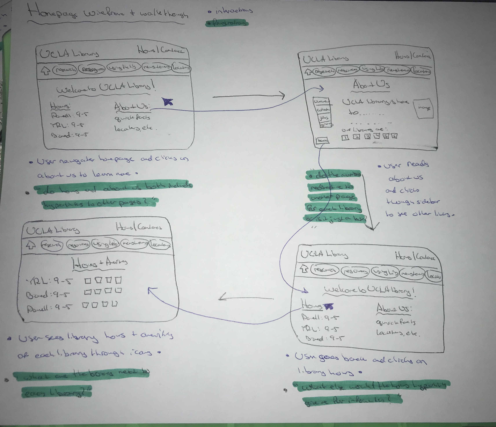
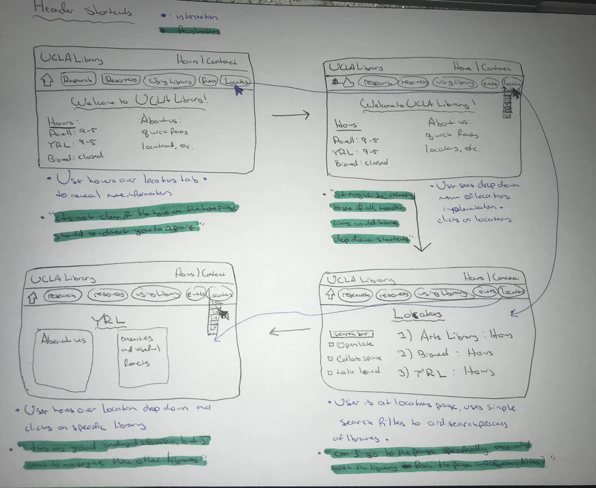
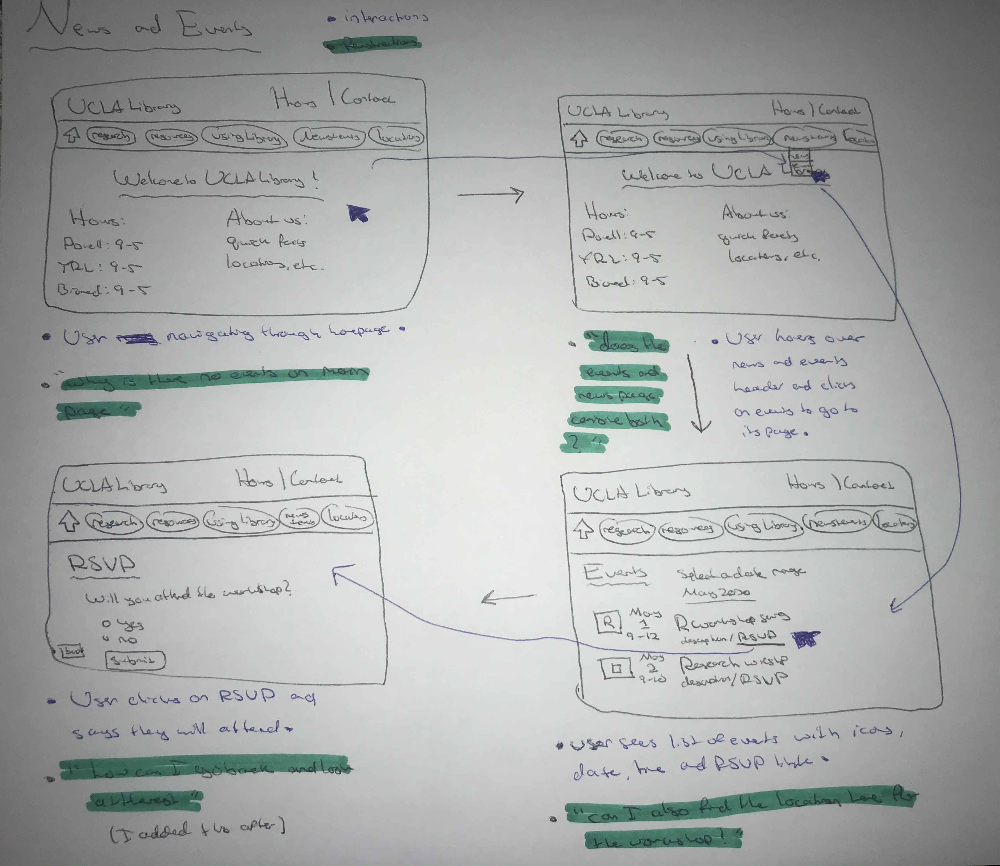

# DH150 Assignment06 - Danya Elgebaly
# Low-fidelity Prototype

## Project Description

The focus of this project is to address the main design and usability issues associated with the online UCLA Library website. The purpose of the website is to provide students, faculty, staff and all members of the UCLA community with useful information regarding research as well as contextual information relevant to the library. The library itself has many useful resources to present including events, workshops, libriarians, tech support and so much more. With the presence of all of this information, it is often very easy to get lost within the site and lose focus of your original intention or perhaps, even fail to find what you're looking for. 

After conducting various user research and usability test, I realized that the biggest difficulties associated with the UCLA Library website are the information overload and the difficulty of finding information. By simply implementing additional features and some information re-organization through the use of a low-fidelity prototype, we can better understand the users' needs and how this may benefit them in the case of a website re-design. As a result, my personas are representatative of individuals who would typically be users of the UCLA Library website and would conduct simple tasks that currently have design issues, which would be addressed through prototyping. 

The personas that I chose to represent my users for this particular project are three different individuals all relevant to UCLA. The first one is Lauren, a 2nd year undergraduate at UCLA who is trying to get involved in research and frequently goes to the Library website to check out what kinds of workshops and events are being held to help her gain better insights as to what she could pursue. Thomas is a 3rd year at UCLA who spends a lot of time at the Library, particularly during late hours and wants an easy way to find the perfect library for him to study at, which opens late and offers collaboration pods. Lastly, Kiara is a potential UCLA student who just conducts research about universities by going through their websites. She is considering attending UCLA, but wants to learn more about the facilities online. 

## Tasks

### 1) Retrieve information easily through _UCLA Library homepage_
- Homepage reorganization, condensing information, and overcoming information overload

### 2) Implementing _Header Shortcuts_
- Simplifying user navigation process by conveying information more appropriately

### 3) Simple information gathering from _News & Events Page_
- Including less links and more relevant information on the page itself
- Allowing visitors to RSVP on the spot

## Prototypes
Blue ink represents user interaction description and flow through interface.
Green highlight represents user experience and verbal documentation. 

1) Wireframe + Wireflow #1: Library Homepage

2) Wireframe + Wireflow #2: Header Shortcuts

3) Wireframe + Wireflow #3: News + Events Page

## Feedback + Reflection

This experience was very useful as it highlighted some issues that arose from my lo-fidelity prototyping process. Many of these were just simple buttons that may have been missing from the interface and more often than not, it seemed as though my physical prototype had difficulties presenting intentions to the user. Although it made it more difficult for the user, it allowed them to think out loud and ask some questions which are documented on the user flows. One of these primary intention issues arose from understanding whether or not a button represented a hyperlink or whether certain buttons could be hovered over in order to bring about drop down menus. Although these were simple issues, they could have been documented better in the prototype itself. However, I now know better and will take it into account in the high-fidelity model.

Overall, the process was very interesting. I think low-fidelity prototyping is very useful in gathering ideas and documenting it straight away on paper, but it does become difficult to be very clear and concise with every button and feature as designers will have to go through multiple iterations of the prototype to get it right. More specifically, gathering these thoughts and designs on pen and paper are valuable as they allow you get a nice image of what you're looking for and then later, refine it through high-fidelity models. Based on the feedback I got from prototype testing, these are some of the problems that I found and how I would address them: 
1) Ambiguous Icons & Symbols
This was one of the main issues as there were lots of symbols or just squares surrounding certain information. These were ideally supposed to represent icons or symbols that were relevant to the resource, particularly on the news and events page as well as the library locations pages. I would better organize these by setting the icons specifically in the prototype, rather than representing them using just a siimple shape. This would help to communicate the point across better.
2) Understanding of Hover Behavior
I think a big difficulty that arises from paper prototypes is understanding of user-technology behavior. Multiple times during the user test, the user did not understand when they could and could not hover and this was particularly due to the limits of low-fidelity prototyping in understanding technical functionalities. I think that this can be revised highly during the high-fidelity prototype, where hovering over a link would darken the color of the button and provide the drop-down menu immediately, which provides feedback to the user and makes it easier to understand on the spot. 
3) Lack of User Freedom
The last problem that seemed to arise throughout was the lack of user freedom to navigate and go back and forth between necessary pages. While this is not always necessary, in some contexts, it would help the user's experience and their ease of navigation. Lots of these included simple back and next buttons, which I would have implemented in the prototype if I didn't overlook them as much as I did. Yet, the user did express concern that this was sometimes limiting to their navigation experience. So, I would go back and make sure I included those where necessary. 
