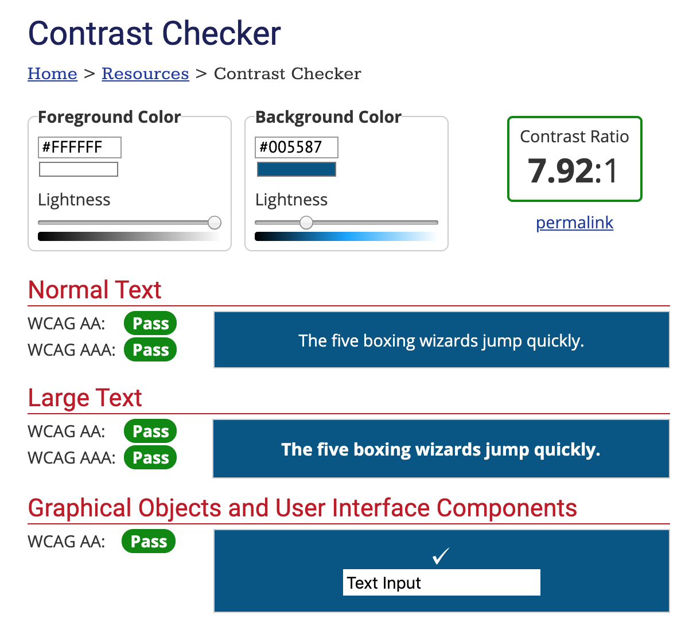

# DH150 Assignment08 - Danya Elgebaly
# High-Fidelity Prototype

## Summary: Prototyping Purpose, Process & Tasks

### Purpose
The purpose of my high-fidelity prototype is to demonstrate the user interaction process with the UCLA Library website through its improved features that were created after user research analysis. The prototype supports certain computer behavior interactions and allows flows between multiple pages to simulate the user experience as if it were a live website!

### Process
I chose to use Figma, an interactive prototyping tool used in the field of UI and UX because it is a well renowned tool and very useful to industry. The whole process involved prototyping for 3 main tasks that were relevant to the UCLA Library homepage, the header, and the News & Events page. I used three personas with specific intentions and wireflows that allowed me to evaluate my specific tasks -- Lauren, Thomas, and Kiara. My first step was actually designing specifically for Kiara, whereby I re-organized the homepage information and included better re-directions to specific library pages for her to be able to effectively navigate through them and learn more. By this point, I had begun getting feedback from classmates and other individuals, who constructively provided me with information about how I can improve usability and general GUI components. I then used this feedback for future screens and conducted a usability test to further clarify that users were able to operate the prototype effectively.

### Tasks Supported by the System

Main Tasks
1) Retrieve simple information from UCLA Library homepage. 
2) Implement easy header shortcuts using drop-down menus for the "News & Events" and the "Locations" pages.
3) Simplifying the "Events" page and allowing automatic RSVP.

#### Sub-Tasks
4) Simple navigation between library pages to explore features, amenities, and collections.
5) Added feature for each individual library page to include their "Least Crowded Time." 

## Screen Designs
The screen designs are presented below:

## GUI Decision Making

While the colors may seem like an odd mixture to users outside of the UCLA community, the decisions I used to design my GUI were quite consistent throughout. 
1. _Color_ -- This is inevitably a very important part of the visual design experience as it draws the user in automatically and contributes greatly to the presentability of design. Perhaps, it is one of the most important components as it initiates the first impression of the website or application. In my particular case, I decided to use a total of about 5 colors - Blue, Gold, Black, Gray, and White. The reason I chose these colors was primarily to mix the branded UCLA colors with their specific Hex values with simple colors like Black, Gray, and White (which were better fit for body text and more subtle buttons).
2. _Typography_ -- I decided to choose a font that was relatively similar to UCLA's general font since I couldn't find that original one. As a result, I chose this font in order to demonstrate professionalism. In addition, I felt like this particular font was readable and also legible, which met my general guidelines for typography. Lastly, ensured that it was consistent throughout in order to alleviate any sort of differences that could arise from changing the appearance of multiple screens. 

I also tested color contrast using the accessibility test presented later on. 

## Wireflow

## Impression Test

While I was unable to conduct a live impression test due to my timezone difference, I have captured some of the comments I received from my peers who reviewed my prototype and provided constructive criticism. The impressions suggested that there were some issues with back and next buttons as well as ambiguities that arise from unlabeled icons, and a lack of understanding regarding what is and what is not considered a button. For the detailed comments, check [here.](https://github.com/delgebaly/DH150-DanyaElgebaly/blob/master/assignment08/Comments.md)

 

## Accessibility Check

For my accessibility check, I decided to conduct two color contrast checks using the foreground/background combinations that were most commmon throughout my website. 

 

## Interactive Prototype

The link to my Figma interactive prototype can be found [here.](https://www.figma.com/proto/v4vw2G8JcrGdeDeoxqeUu5/DH-150-Prototype?node-id=2%3A1&scaling=min-zoom) Make sure to adjust the page to fit your screen using the options button at the top right.

## Cognitive Walkthrough
I learned a lot about the functionality of my prototype from the Cognitive Walkthrough. Specifically, some of the button features that I initially had were ambiguous throughout -- I would underline to signify the use of a button, but would also do it for emphasis which provided confusion to the user of whether something was clickable or not. In addition, the shapes of some of the buttons were confusing at first, so my peers suggested to maybe think of a more simplistic way to communicate the buttons. Many other visual components such as inconsistent font size and the lack of differences between size of titles and body text were noted and further adjusted later. 

Evidence of my Cognitive Walkthrough is presented through my remote review feedback attached [here.](https://github.com/delgebaly/DH150-DanyaElgebaly/blob/master/assignment08/DH150-Remote-Review-Danya.pdf)

## Usability Testing

### Insights:
The Usability Test phase was very important as it allowed me to fully investigate how a user is interacting with the prototype visually and verbally. I conducted a usability test via Zoom, whereby I could see the user answer questions regarding the prototype while going through the screens and interacting with it. The main insight that I found was that some of my interactions were not very intuitive, particularly the flow on the next and back buttons. This created a tedious load on the user, which I adjusted in my next round of edits. I also noticed that my user didn't at all use the "next" button and was not aware if maybe they didn't notice it, or they didn't find it useful. As a result, I adjusted this later by making it more noticeable for the user. 

The results of my UT Test are available [here.](https://docs.google.com/spreadsheets/d/1pNVVtpPsVQybW_8AyWnjBbDevjPQYRVUjlKXyX4uq4M/edit?usp=sharing)
The video of my UT can be found [here.](https://drive.google.com/file/d/1u3ZWcgV523OldmnUVLr-yDlMbld43qKP/view?usp=sharing)

## Reflection

This process was a great process for me to learn and implement some of the concepts that I've learned about both visual design and usability interaction principles! I really enjoyed the process and experimenting with Figma. Sometimes, it got quite difficult to get carried away because designing for specific tasks allows for re-design of certain features, not all. I wish I would have given myself more time over the past two weeks to separate design of the tasks and test for each one and conduct multiple usability tests. I think I addressed some of the design issues that appeared from my first iteration based on the impression test and comments I received, but I would love to receive more feedback for my second iteration. In addition, I would also like to stay better organized with my prototyping process because I didn't label my objects/icons in Figma accordingly and as screens and assets started to increase, the visual presentation of the prototype became a lot messier and harder to design effectively. From a more holistic perspective based on my feedback, I would probably re-design one of the other pages from my header to adhere to "Requesting a Book" because that was noted by some of my revieweres and I didn't adjust it because I didn't want to make the header look too busy. Regardless, this was a really fun process and I learned a lot about my design strengths, weaknesses, and what it means for design to be a truly iterative process!
